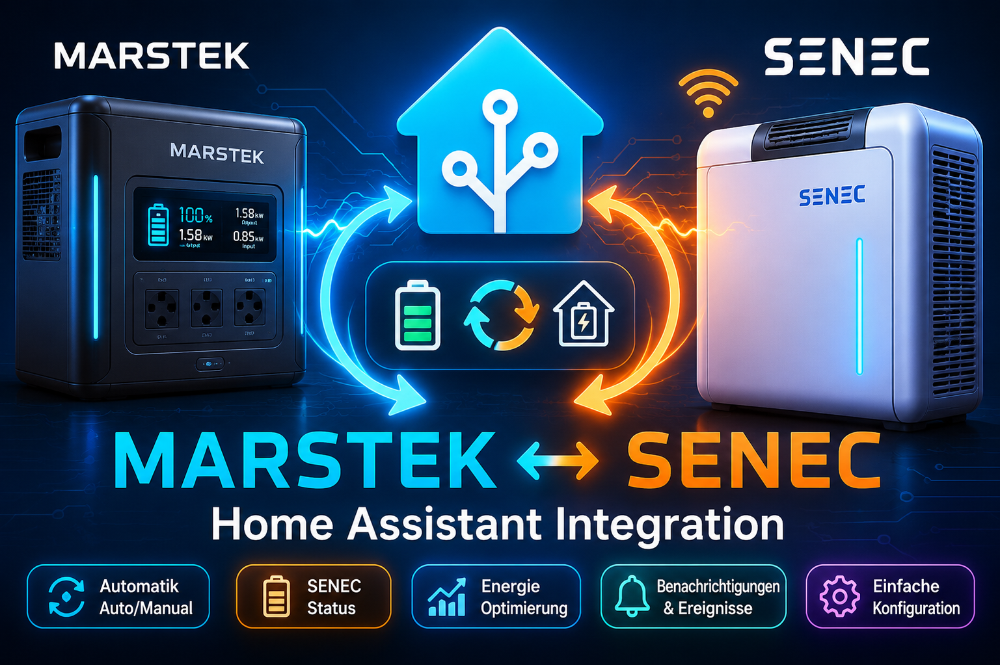

<p align="center">
  
</p>

# Marstek SENEC Home Assistant Integration

<p align="center">
  
</p>

# Marstek SENEC Controller – Home Assistant Custom Integration

Diese Custom Integration schaltet einen Marstek-Speicher automatisch zwischen **AUTO** und **MANUAL**, abhängig von Ladeleistung und SOC eines SENEC-Speichers oder eines anderen Referenzspeichers.

The integration should also work with other battery storage systems as long as their charging power and state of charge are available as Home Assistant sensor entities and scripts exist to switch the Marstek system between AUTO and MANUAL.

## Funktionen

- echte Home-Assistant-Custom-Integration für HACS
- Einrichtung über die Home-Assistant-Oberfläche
- keine YAML-Automation mehr notwendig
- minütliche Prüfung des Speicherzustands
- keine Schaltung bei `unknown` oder `unavailable`
- AUTO, wenn:
  - Ladeleistung des Referenzspeichers über Schwellwert liegt, Standard `2300 W`
  - SOC voll ist, Standard `>= 100 %`
  - SOC leer ist, Standard `< 5 %`
- sonst MANUAL
- verhindert unnötiges erneutes Ausführen desselben Scripts
- Diagnose-Sensoren für Entscheidung, Grund und Fehler
- Buttons zum manuellen Erzwingen von AUTO oder MANUAL

## Voraussetzungen

Du brauchst in Home Assistant:

- Sensor für Ladeleistung des Referenzspeichers in Watt
- Sensor für SOC des Referenzspeichers in Prozent
- Sensor für aktuellen Marstek-Modus, z. B. `Auto` oder `Manual`
- Script zum Umschalten auf AUTO
- Script zum Umschalten auf MANUAL

Beispiel:

```yaml
script:
  marstek_auto_mode:
    alias: Marstek AUTO mode
    sequence:
      - service: button.press
        target:
          entity_id: button.marstek_venuse_auto_mode

  marstek_manual_mode:
    alias: Marstek MANUAL mode
    sequence:
      - service: button.press
        target:
          entity_id: button.marstek_venuse_manual_mode
```

## Installation über HACS als Custom Repository

1. HACS öffnen
2. Oben rechts auf die drei Punkte klicken
3. **Custom repositories** auswählen
4. Repository-URL eintragen
5. Kategorie **Integration** auswählen
6. Repository hinzufügen
7. Integration installieren
8. Home Assistant neu starten
9. Einstellungen → Geräte & Dienste → Integration hinzufügen
10. **Marstek SENEC Controller** suchen und einrichten

## Manuelle Installation

Kopiere diesen Ordner:

```text
custom_components/marstek_senec
```

nach:

```text
/config/custom_components/marstek_senec
```

Danach Home Assistant neu starten.

## GitHub Repository Struktur

Für HACS muss die Struktur so aussehen:

```text
custom_components/
└── marstek_senec/
    ├── __init__.py
    ├── manifest.json
    ├── config_flow.py
    ├── sensor.py
    ├── button.py
    ├── const.py
    └── translations/
hacs.json
README.md
```

## Empfohlene GitHub Topics

```text
home-assistant
home-assistant-integration
hacs
marstek
senec
battery-storage
energy-management
solar-energy
```

## Hinweis

Diese Integration steuert Energiehardware indirekt über Home-Assistant-Scripts. Teste die Logik zuerst kontrolliert und überwache das Verhalten deines Speichersystems.
